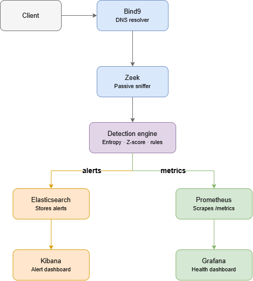
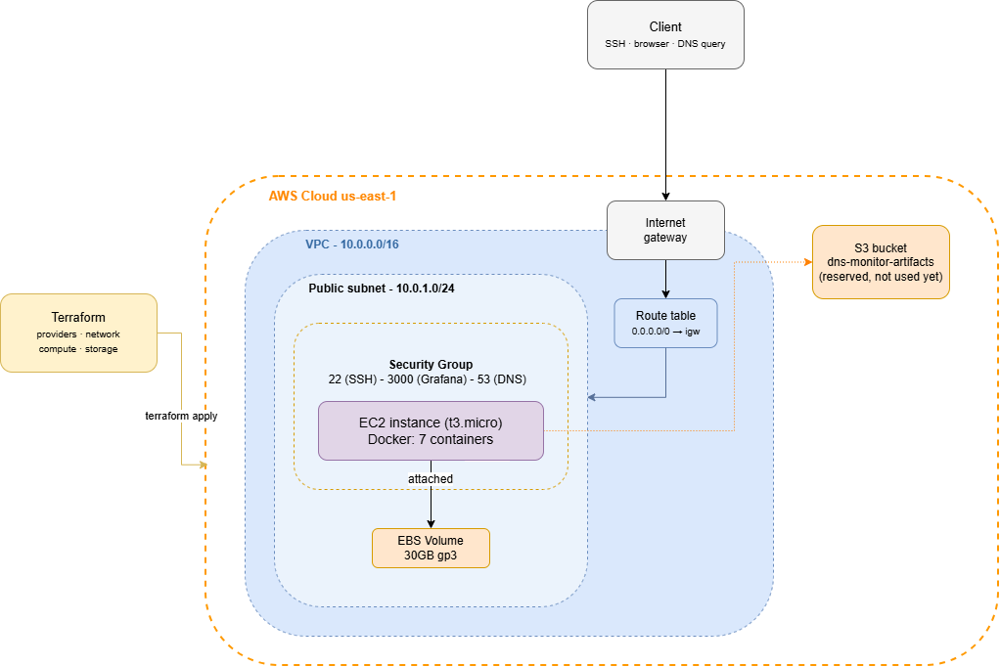

# DNS Security Monitor

[](https://github.com/CrisrShell/dns-sec-monitor/actions)

Real-time DNS tunnelling detection using Shannon entropy and statistical analysis — containerised, tested, observable, and deployable to AWS as code.

---

## What it is

A real-time DNS monitoring pipeline that passively inspects DNS traffic and flags statistical signs of tunnelling — without decrypting payloads or relying on signature databases. Built for **network security analysts, SOC/NOC operators, and sysadmins** who want visibility into DNS as an attack surface, and as a reference architecture for anyone learning detection engineering, observability, or infrastructure-as-code.

**What it does:**
- Passively captures every DNS query on the network (no agents, no endpoint software)
- Scores each query against four statistical rules in real time
- Ships alerts to a searchable index and a live dashboard
- Exposes its own health metrics, so "is it working" is never a guess
- Deploys identically to a laptop or to AWS, defined entirely as code

> This is a portfolio-grade reference implementation of real detection engineering — not a hardened production tool. Kibana and Grafana have no authentication by default, Elasticsearch runs single-node, and TLS isn't configured anywhere. Treat it as a learning platform and architecture reference, not a drop-in SOC product.

## The problem

DNS is the one protocol almost no network blocks — block it and nothing works. That makes it an attractive covert channel: attackers encode stolen data into subdomain names (`a7f3k9d2m8x1p4q6.evil.com`) and let the victim's own resolver deliver the query straight to a nameserver they control. No firewall rule is broken; the network's own infrastructure does the smuggling.

This can't hide its own mechanics, though. Encoded data produces long, high-entropy names. Malware phoning home produces repeated queries to the same domain. Failed lookups pile up as NXDOMAIN. This project watches DNS traffic for exactly those statistical fingerprints — no payload inspection, no signature database, just the shape of the traffic.

## Architecture



A client's DNS query passes through **Bind9** (resolver), is passively captured by **Zeek** (sitting in Bind9's network namespace — the one chokepoint where every query is visible before it goes anywhere), and analysed by the **Python detection engine**. Results split two ways: alerts go to **Elasticsearch/Kibana**, engine health metrics go to **Prometheus/Grafana**.

| Component | Role |
|---|---|
| Bind9 | Recursive DNS resolver |
| Zeek | Passive network sniffer, shares Bind9's network namespace |
| Detection engine | Python — applies the four rules below to every query |
| Elasticsearch / Kibana | Stores and visualises alerts |
| Prometheus / Grafana | Scrapes and visualises engine health |

## Detection rules

| Rule | Trigger | Signal for |
|---|---|---|
| Shannon entropy | Query name entropy > 4.0 | Encoded/random-looking data |
| Query length | Longer than 50 characters | Data-heavy encoding |
| NXDOMAIN | Failed resolution | Non-existent/generated names |
| Frequency z-score | Repeated queries to one domain | Beaconing / command-and-control |

## Tech stack

**Application:** Python 3.12 · Docker & Docker Compose
**Detection & storage:** Zeek · Elasticsearch · Kibana
**Observability:** Prometheus · Grafana (fully provisioned as code)
**Quality:** pytest (98% coverage on the detection engine) · ruff · mypy · GitHub Actions CI
**Infrastructure:** Terraform · AWS (VPC, EC2, S3) · Floci (local AWS emulator for development)

## Quick start

```bash
git clone https://github.com/CrisrShell/dns-sec-monitor.git
cd dns-sec-monitor
docker compose up -d
```

Wait ~60 seconds for all services to report healthy, then trigger a query.

**Linux/macOS:**
```bash
# Any query wakes the engine on first start
dig @127.0.0.1 google.com

# A long, random query triggers the entropy rule
dig @127.0.0.1 k4m8p2w6z0x9c3v7b1nqasdfgh.google.com
```

**Windows (PowerShell):**
```powershell
Resolve-DnsName google.com -Server 127.0.0.1
Resolve-DnsName "k4m8p2w6z0x9c3v7b1nqasdfgh.google.com" -Server 127.0.0.1
```

(`nslookup` also works on any platform if you prefer it — `dig` is used here since it's the standard tool network engineers reach for on Linux/Unix.)

- **Kibana** (alerts): http://localhost:5601
- **Grafana** (engine health): http://localhost:3000

## Testing & code quality

```bash
cd engine
pip install -e ".[dev]"
ruff check . && ruff format --check .
mypy src
pytest --cov=dns_monitor
```

16 tests, 98% coverage on the detection engine. All three checks run automatically on every push via GitHub Actions.

## Cloud deployment



The full stack deploys to AWS as code with Terraform: a VPC, public subnet, security group (SSH and Grafana restricted to a configurable IP, DNS open), and an EC2 instance that provisions itself on boot — installing Docker, cloning this repo, and starting the stack, with no manual setup.

```bash
cd infra/terraform
export AWS_ACCESS_KEY_ID=...
export AWS_SECRET_ACCESS_KEY=...
export TF_VAR_my_ip=$(curl -s https://checkip.amazonaws.com)/32
terraform apply
```

Development and testing of the Terraform is done locally against [Floci](https://floci.io), an open-source AWS emulator, before promoting to real AWS — the same configuration works against both; only the provider block changes.

## Project structure

```
dns-sec-monitor/
├── docker-compose.yml       # 7-container local stack
├── engine/                  # Python detection engine
│   ├── src/dns_monitor/
│   │   ├── detection/       # the four rules, entropy, z-score
│   │   ├── ingestion/       # tails Zeek's log
│   │   └── reporting/       # ships alerts to Elasticsearch
│   └── tests/                # 16 pytest tests
├── infra/
│   ├── bind9/ zeek/ prometheus/ grafana/
│   └── terraform/            # AWS infrastructure as code
└── docs/                      # architecture diagrams
```

## License

MIT — see [LICENSE](LICENSE).
